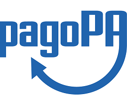

- [pagoPA, Specifiche Attuative del Nodo dei Pagamenti-SPC versione 2.2.6](#pagopa-specifiche-attuative-del-nodo-dei-pagamenti-spc-versione-226)
  - [Come aggiornare la documentazione](#come-aggiornare-la-documentazione)
    - [Pubblicazione DocsItalia](#pubblicazione-docsitalia)
  - [Come creare una segnalazione](#come-creare-una-segnalazione)
  - [Importante](#importante)
# pagoPA, Specifiche Attuative del Nodo dei Pagamenti-SPC versione 2.2.6

**pagoPA** _è un sistema per rendere più semplici, sicuri e trasparenti tutti i pagamenti verso la Pubblica Amministrazione._

Il sistema dei pagamenti elettronici a favore della Pubblica Amministrazione, il sistema **pagoPA**, garantisce agli utilizzatori finali (cittadini e imprese) di effettuare pagamenti elettronici alla Pubblica Amministrazione in modo sicuro e affidabile, semplice, in totale trasparenza nei costi di commissione e in funzione delle proprie esigenze.

Le specifiche attuative del nodo dei pagamenti sono descritte in formato markdown e suddivise nelle cartelle :
- _sezione1-funzionamento-generale-del-sistema_
- _sezione2-gestione-posizione-debitoria_
- _sezione3-specifiche-tecniche_
- _sezione4-adesione-al-sistema_

Ogni cartella contiene più file `.md` che rappresentano i diversi capitoli del documento ed un file `index.rst` che rappresenta l'indice della sezione.
Ogni file markdown non contiene immagini/diagrammi ma riferimenti ad essi.

La cartella `puml-diagrams` contiene tutti gli schemi UML in formato [PlantUML](https://plantuml.com/) che vengono geneati nella cartella `diagrams` ed utilizzati all'interno del documento.
La cartella `images` contiene tutte le immagini utilizzate nel documento.

## Come aggiornare la documentazione

Per modificare la documentazione, esegui [commit](https://github.com/git-guides/git-commit) sul relativo capitolo inserendo un messaggio esplicativo della modifica ed eventualmente facendo riferimento ad un [issue](https://docs.github.com/en/free-pro-team@latest/github/managing-your-work-on-github/creating-an-issue)
Per fare riferimento ad un diagramma utilizza il percorso `../diagrams/<nome-file-puml>.png`
Per fare riferimento ad un immagine  utilizza il percorso `../images/<nome-file-img>`

- Per modifica un diagramma , modifica ( o aggiungi ) il relativo file `.puml` all'interno della cartella `puml-diagrams`
- Per modificare un immagine, modifica ( o aggiungi) il relativo file all'interno della cartella `images`

### Pubblicazione DocsItalia
Le Specifiche attuative sono disponibili anche su docsItalia il quale utilizza il formato rst.
su docsItalia viene pubblicato tutto il contenuto della cartella *_docs*

Per generare la documentazione da pubblicare su [docsItalia](https://docs.italia.it/) utilizzare `npm start`. 

Verranno generati i diagrammi, le immagini ed i relativi documenti rst convertiti da markdown.

Bisogna poi eseguire commit dei file aggiornati.
> il processo di modifica è documentato in dettaglio [qui](./howto_change_sanp_wf/README.md)

## Come creare una segnalazione

Creare una segnalazione in `Github` é molto semplice e puoi farlo direttamente dal tuo account.
> Se non hai già un account su Github lo puoi creare [registandoti](https://github.com/) usando sia la tua mail personale che aziendale.

Una volta registato, puoi aggiungere una nuova segnalazione _(New issue)_ cliccando sul pulsante verde indicato di seguito:

## Importante
Per favore, **non inserire segnalazioni riguardanti pagamenti**. Evita, per esempio, qualsiasi nome, cognome, o codice fiscale.

Inoltre, **non inserire nessun dato relativo a configurazioni di sicurezza, quali certificati o password.**

In ogni caso è opportuno inserire una descrizione accurata della tematica che si vuole segnalare.

