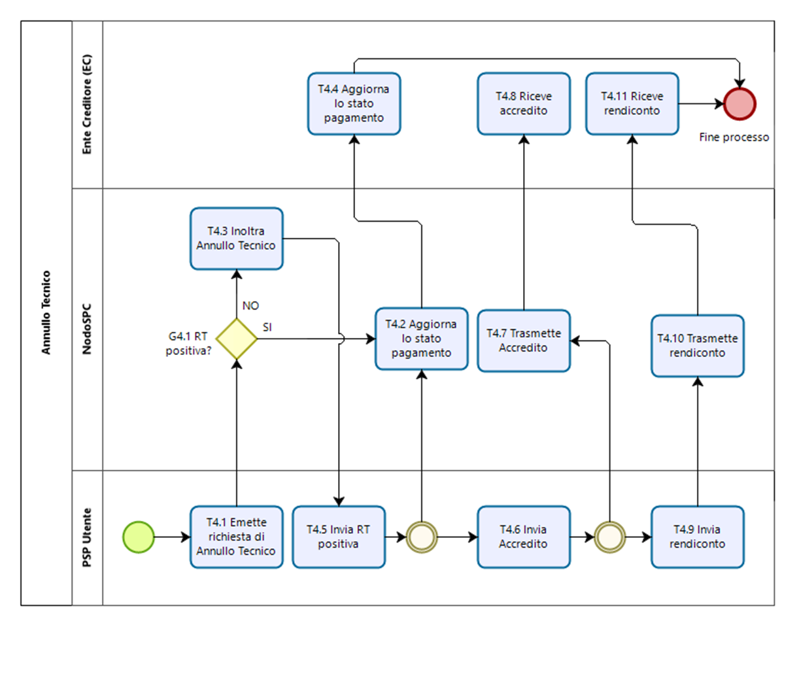
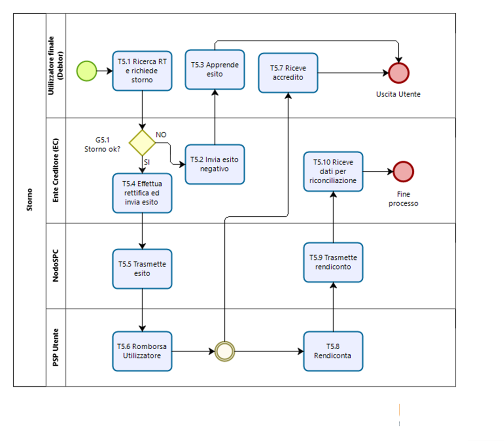

Funzioni accessorie
===================

Revoca della Ricevuta Telematica
--------------------------------

Qualora l'utilizzatore finale - ai sensi degli articoli 13 e 14 del
decreto legislativo 27 gennaio 2010, n. 11, ovvero per richieste
regolamentate connesse all'utilizzo di carte di pagamento (c.d.:
procedura di *charge back*, nella quale non rientrano i casi di frode ma
unicamente i casi in cui l'Utilizzatore finale richieda un rimborso per
un pagamento effettuato a fronte di un servizio di cui non ha usufruito)
chieda al proprio prestatore di servizi di pagamento il rimborso di un
pagamento già completato, il Sistema pagoPA mette a disposizione di
Prestatori di Servizi di Pagamento e Enti Creditori idonee funzionalità
per gestire la revoca della ricevuta telematica inviata in precedenza.

Come indicato in **Figura 1**, la revoca della ricevuta telematica si
esplica nell'invio di una richiesta di revoca (RR) da parte del
Prestatore di Servizi di Pagamento, contenente i riferimenti della
ricevuta telematica oggetto della revoca e nella risposta da parte
dell'Ente Creditore contenente l'esito della revoca (ER).

{width="4.96319in"
height="5.16052in"}

**Figura** **1: Il processo di revoca**

Il processo è iniziato dall'Utilizzatore finale, che richiede la revoca
al proprio Prestatore di Servizi di Pagamento (*Task* T3.1), a seguito
della quale quest'ultimo inoltra la richiesta all'Ente Creditore (*Task*
T3.2) attraverso il NodoSPC (*Task* T3.3).

L'Ente Creditore esamina la richiesta (*Gateway* G3.1):

-   L\'Ente Creditore non consente la revoca di una ricevuta telematica
    se il pagamento associato è contestuale all\'erogazione di un
    servizio (ad esempio: acquisto di biglietti per musei o trasporti
    pubblici, prestazioni sanitarie già eseguite, ecc.) inviando un ER
    di esito negativo (*Task* T3.4) che viene trasmesso dal NodoSPC al
    Prestatore di servizi di Pagamento (*Task* T3.5) e da questi
    all'Utilizzatore finale (*Task* T3.6) che apprende l'esito (*Task*
    T3.5)
-   In caso contrario l'Ente Creditore, entro tempi compatibili con il
    procedimento richiesto, esamina la richiesta e invia l\'esito della
    revoca, aggiornando i propri archivi informatici e riaprendo la
    posizione debitoria se necessario (*Task* T3.8). L'esito positivo è
    trasmetto dal NodoSPC al Prestatore di Servizi di Pagamento (*Task*
    T3.9), il quale esegue il riaccredito verso l'Utilizzatore finale
    (*Task* T3.10), il quale lo riceve direttamente senza l'intervento
    del NodoSPC (*Task* T3.7). Il Prestatore di servizi di Pagamento
    recupera la somma dovuta compensandola sui successivi accrediti da
    effettuare verso l'Ente Creditore ed espone la cifra (negativa) sul
    successivo rendiconto (*Task* T3.11), che viene trasmesso all'Ente
    Creditore attraverso il NodoSPC (*Task* T3.12). A questo punto
    l'Ente Creditore è in grado di riconciliare correttamente gli
    importi (*Task* T3.13)

In ogni caso, l'Ente Creditore deve predisporre - e darne evidenza sul
proprio sito attraverso il quale sono effettuati i pagamenti - apposite
procedure amministrative di back-office al fine di gestire, nel rispetto
della normativa vigente, i flussi relativi a reclami, rimborsi e revoche
sia dal punto di vista amministrativo, sia dal punto di vista contabile.

Annullo tecnico
---------------

L'annullo tecnico è una casistica dell'invio di una richiesta di revoca
che indica che la RT inviata è tecnicamente errata, dunque il Prestatore
di Servizi di Pagamento può invocarla unicamente ricorra uno dei
seguenti casi di errori procedurali:

a)  Invio di una Ricevuta Telematica (RT) con esito **positivo**,
    tuttavia l'utilizzatore finale non ha ricevuto nessun addebito né il
    Prestatore di Servizi di Pagamento ha emesso alcuna attestazione di
    pagamento (scontrino, ricevuta, e-mail, ecc.);
b)  Invio di una Ricevuta Telematica (RT) con esito **negativo**,
    tuttavia l'utilizzatore finale ha ricevuto un addebito e il
    Prestatore di Servizi di Pagamento ha emesso un'attestazione di
    pagamento (scontrino, ricevuta, e-mail, ecc.).

Il processo di annullo tecnico, descritto in **Figura 2**, è il seguente

{width="5.52049in"
height="4.83819in"}

**Figura** **2: Processo di annullo tecnico**

Il Prestatore di servizi di Pagamento invia la richiesta di annullo
tecnico al NodoSPC (*Task* T4.1), che verifica la casistica del caso
(*Gateway* G4.1):

-   Nel caso in cui sia stata inviata una ricevuta telematica positiva
    senza l'avvenuto pagamento, il nodo aggiorna lo stato del pagamento
    ed invia l'informazione all'Ente Creditore (*Task* T4.2), il quale
    aggiorna i suoi archivi informatici (*Task* T4.4)
-   Nel caso in cui sia stata inviata una ricevuta telematica negativa a
    fronte di un avvenuto pagamento, in NodoSPC invia l'informazione di
    effettuare l'annullo tecnico (*Task* T4.3) sia all'Ente Creditore,
    in quale aggiorna i propri archivi informatici (*Task* T4.4), che al
    Prestatore di servizi di Pagamento, il quale può procedere all'invio
    dell'accredito (*Task* T4.6), che viene ricevuto dall'Ente Creditore
    (*Task* T4.8) attraverso il NodoSPC (*Task* T4.7), che all'inoltro
    della rendicontazione (*Task* T4.9), che viene anch'esso ricevuto
    dall'Ente Creditore (*Task* T4.11) attraverso il NodoSPC (*Task*
    T4.10)

Storno del pagamento
--------------------

Qualora l'Utilizzatore finale chieda a vario titolo l'annullamento
(storno) di un pagamento all'Ente Creditore presso il quale questo è
stato disposto, il sistema mette a disposizione dell'Ente Creditore e
del Prestatore di Servizi di Pagamento idonee funzionalità del NodoSPC
per gestire detta operazione.

L'Ente Creditore deve predisporre - e darne evidenza sul proprio sito
attraverso il quale sono effettuati i pagamenti - apposite procedure
amministrative di back-office al fine di gestire, nel rispetto della
normativa vigente, le richieste di storno del pagamento ed i relativi
flussi economici (**Figura 3**).

{width="5.13699in"
height="4.56458in"}

**Figura** **3: Processo di storno di un pagamento**

Il processo di storno viene iniziato dall'Utilizzatore finale che lo
richiede all'Ente Creditore (*Task* T5.1)

L'Ente Creditore esamina la richiesta (*Gateway* G5.1):

-   In caso di esito negativo, l\'Ente Creditore comunica l'informazione
    all'Utilizzatore finale (*Task* T5.2) che apprende l'esito (*Task*
    T5.3)
-   In caso contrario l'Ente Creditore, entro tempi compatibili con il
    procedimento richiesto, esamina la richiesta e invia l\'esito dello
    storno, aggiornando i propri archivi informatici e riaprendo la
    posizione debitoria se necessario (*Task* T5.4). L'esito positivo è
    trasmesso dal NodoSPC al Prestatore di Servizi di Pagamento (*Task*
    T5.5), il quale esegue il riaccredito verso l'Utilizzatore finale
    (*Task* T5.6) che lo riceve direttamente senza l'intervento del
    NodoSPC (*Task* T5.7). Il Prestatore di Servizi di Pagamento
    recupera la somma dovuta compensandola sui successivi accrediti da
    effettuare verso l'Ente Creditore ed espone la cifra (negativa) sul
    successivo rendiconto (*Task* T5.8) che viene trasmesso all'Ente
    Creditore attraverso il NodoSPC (*Task* T5.8). A questo punto l'Ente
    Creditore è in grado di riconciliare correttamente gli importi
    (*Task* T5.10).

Attestazione del pagamento
--------------------------

L'attestazione di avvenuto pagamento è rappresentata dal documento
informatico (Ricevuta Telematica) che l'Ente Creditore riceve dal
Prestatore di Servizi di Pagamento.

L'Ente Creditore deve rendere disponibile, su richiesta
dell'utilizzatore finale, tale documento, sia sotto forma di duplicato
informatico che sotto forma di copia analogica dello stesso. Poiché
nelle ricevute telematiche possono essere contenuti da 1 a 5 pagamenti
aventi lo stesso ente beneficiario, sarà cura dell'Ente Creditore, se
del caso, produrre tante copie analogiche quanti sono i pagamenti
effettuati contenuti nella stessa ricevuta telematica.

Laddove l'Ente Creditore sia chiamato a predisporre un'attestazione del
pagamento ricevuto da parte del pagatore e debba indicare in tale
attestazione la data e l'orario del pagamento, si dovrà tenere conto
della data e dell'orario dell'interazione che il pagatore ha eseguito
per finalizzare il pagamento con l'Ente Creditore o con il PSP,
rispettivamente per i pagamenti eseguiti presso l'Ente Creditore e per i
pagamenti eseguiti presso il PSP.

In particolare, l'Ente Creditore dovrà comportarsi come segue:

-   per i pagamenti eseguiti presso l'Ente Creditore, fa fede la data e
    l'orario indicato nella RPT, a condizione ovviamente che tale RPT
    abbia dato come esito una RT positiva;
-   per i pagamenti eseguiti presso il PSP, fà fede la data e l'orario
    indicati nell'attestazione (scontrino) rilasciato dal PSP.

Nel caso di pagamento attivato presso il Prestatore di Servizi di
Pagamento, questi fornisce direttamente all'Utilizzatore finale un
documento (ricevuta, scontrino, ecc.) che rappresenta un estratto
analogico del documento informatico che il Prestatore di Servizi di
Pagamento invierà successivamente all'Ente Creditore. Tale documento può
essere utilizzato dall'Utilizzatore finale per ottenere quietanza da
parte dell'EC.

Le copie analogiche prodotte dall'Ente Creditore o dai Prestatori di
Servizi di Pagamento devono necessariamente contenere, oltre al logo del
Sistema pagoPA, almeno le seguenti informazioni:

-   Data e ora dell'operazione
-   Codice fiscale e denominazione dell'Ente Creditore
-   Identificativo univoco versamento (IUV) - Identificativo univoco
    assegnato dall'Ente Creditore
-   Codice identificativo del Prestatore di Servizi di Pagamento
-   Numero univoco assegnato al pagamento dal Prestatore di Servizi di
    Pagamento
-   Importo dell'operazione
-   Causale del versamento indicata nella richiesta di pagamento
    telematico.

Riconciliazione dei pagamenti
-----------------------------

Con rifermento alle macro-fasi del processo, una volta effettuata la
fase di "Regolamento contabile" da parte del Prestatore di Servizi di
Pagamento, l'Ente Creditore provvede a riconciliare le ricevute
telematiche (RT) con le informazioni contabili fornite dal proprio
istituto tesoriere o da Poste Italiane in relazione agli incassi
avvenuti sui c/c postali (ad esempio: Giornale di Cassa per le Pubbliche
Amministrazioni che utilizzano il formato OIL/OPI; altre modalità per le
Pubbliche Amministrazioni centrali che possono richiedere tali
informazioni alla Ragioneria Generale dello Stato).

Secondo quanto indicato dalle Linee guida e dal suo Allegato A
*\"Specifiche attuative dei codici identificativi di versamento,
riversamento e rendicontazione*\", il Prestatore di Servizi di Pagamento
che riceve l'ordine dal proprio cliente o che esegue l'incasso per conto
dell'Ente Creditore può regolare contabilmente l'operazione in modalità
singola o in modalità cumulativa, il che comporta per l'Ente Creditore
due diverse modalità di riconciliazione.

### Riconciliazione in modalità singola

Qualora, a fronte di ogni singolo set di informazioni contenuto in una
richiesta di pagamento, il Prestatore di Servizi di Pagamento effettui
una singola disposizione di pagamento nei confronti dell'Ente Creditore
per regolare contabilmente l'operazione (ad esempio: l'utilizzo della
forma tecnica "bonifico di tesoreria"), si parla di riconciliazione in
modalità singola.

L'operazione di riconciliazione in modalità singola viene effettuata
dall'Ente Creditore sulla base della seguente coppia di informazioni
presenti sulla ricevuta telematica inviata dal Prestatore di Servizi di
Pagamento all'Ente Creditore:

-   Identificativo univoco versamento (IUV) che deve coincidere con la
    componente identificativo univoco versamento della causale della
    disposizione di accredito inviata al Prestatore di Servizi di
    Pagamento dall'Ente Creditore, secondo le indicazioni di cui alla
    Sezione I dell'Allegato A alle Linee guida;
-   ì-esima occorrenza del dato relativo al singolo importo pagato della
    Ricevuta Telematica che deve coincidere con il dato presente
    nell'informazione della disposizione di accredito inviata al
    Prestatore di Servizi di Pagamento dall'Ente Creditore.

### Riconciliazione in modalità multipla

Qualora il Prestatore di Servizi di Pagamento effettui un'unica
disposizione cumulativa di pagamento nei confronti dell'Ente Creditore
per regolare contabilmente i pagamenti relativi agli esiti contenuti in
una o più ricevute telematiche, si parla di Riconciliazione in modalità
multipla che viene effettuata dall'Ente Creditore sulla base dei dati
forniti dal proprio istituto tesoriere e di quelli contenuti nel flusso
di rendicontazione che il Prestatore di Servizi di Pagamento deve
inviare all'Ente Creditore stesso.

La riconciliazione in questo caso deve essere effettuata in due fasi:

-   nella prima fase il dato identificativo del flusso - presente nella
    causale del SEPA Credit Transfer inviato dal Prestatore di Servizi
    di Pagamento all'Ente Creditore - deve essere abbinato con quello
    presente nel Flusso di rendicontazione inviato all'Ente Creditore
    dal Prestatore di Servizi di Pagamento che ha eseguito i pagamenti.
-   Nella seconda fase della riconciliazione l'Ente Creditore abbinerà i
    dati contenuti nel Flusso di rendicontazione di cui sopra con i dati
    presenti nelle ricevute telematiche (RT) memorizzate presso di sé
    sulla base della seguente coppia di informazioni:
    a.  Identificativo univoco versamento presente sulla ricevuta
        telematica inviata all'Ente Creditore che deve coincidere con lo
        stesso dato presente nella struttura dati del Flusso di
        rendicontazione;
    b.  importo presente sulla ricevuta telematica inviata all'Ente
        Creditore che deve coincidere con il dato omonimo presente nella
        struttura dati del Flusso di rendicontazione.

Il NodoSPC fornisce apposite funzioni centralizzate a disposizione dei
Prestatori di Servizi di Pagamento e degli Enti Creditori, con le quali
i primi possono inviare il Flusso di rendicontazione e gli altri
ricevere i dati ivi contenuti.

### Pagamento contenente più accrediti

Qualora l'utilizzatore finale presenti al Prestatore di Servizi di
Pagamento una RPT contenente più pagamenti ovvero presenti un "carrello"
di richieste di pagamento telematico aventi più beneficiari, il
Prestatore di Servizi di Pagamento deve effettuare un unico addebito
verso l'Utilizzatore finale al quale attribuisce lo stesso
identificativo univoco di riscossione: pertanto l'Ente Creditore dovrà
opportunamente tenerne conto nelle proprie procedure applicative di
riconciliazione.

Altre funzioni accessorie
-------------------------

Seppur meno utilizzate nella pratica comune, si citano di seguito alcune
ulteriori funzione accessorie messe a disposizione dal Sistema pagoPA:

-   Richiesta di una copia della ricevuta telematica
-   Richiesta dell'elenco delle richieste di pagamento telematico
    pendenti
-   Gestione della ricevuta telematica di notifica decorrenza termini

I dettagli relativi alle suddette funzioni sono riportati nella sezione
III
