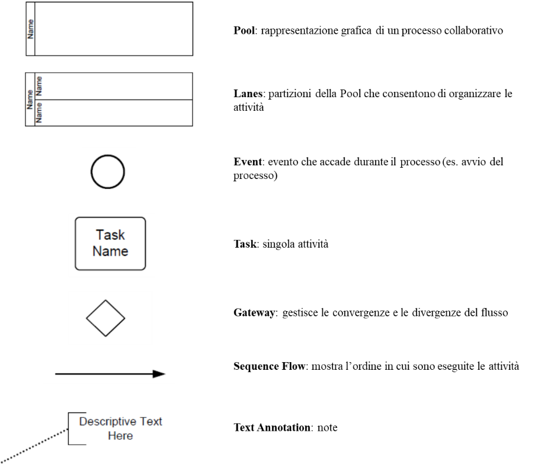
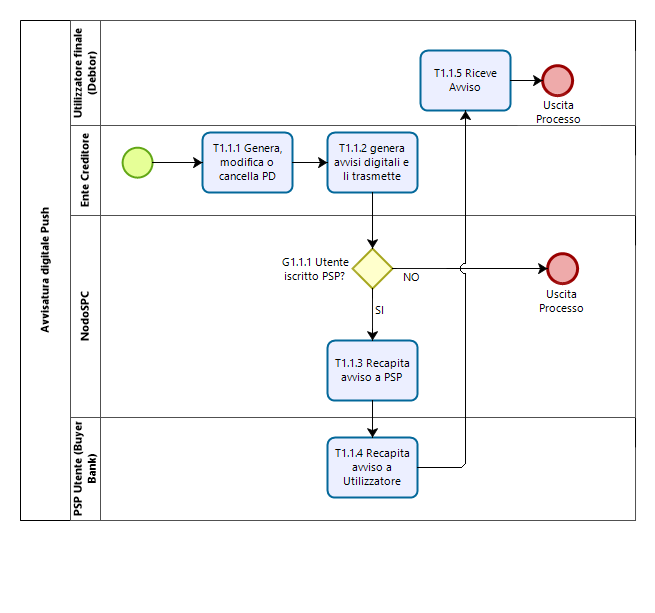
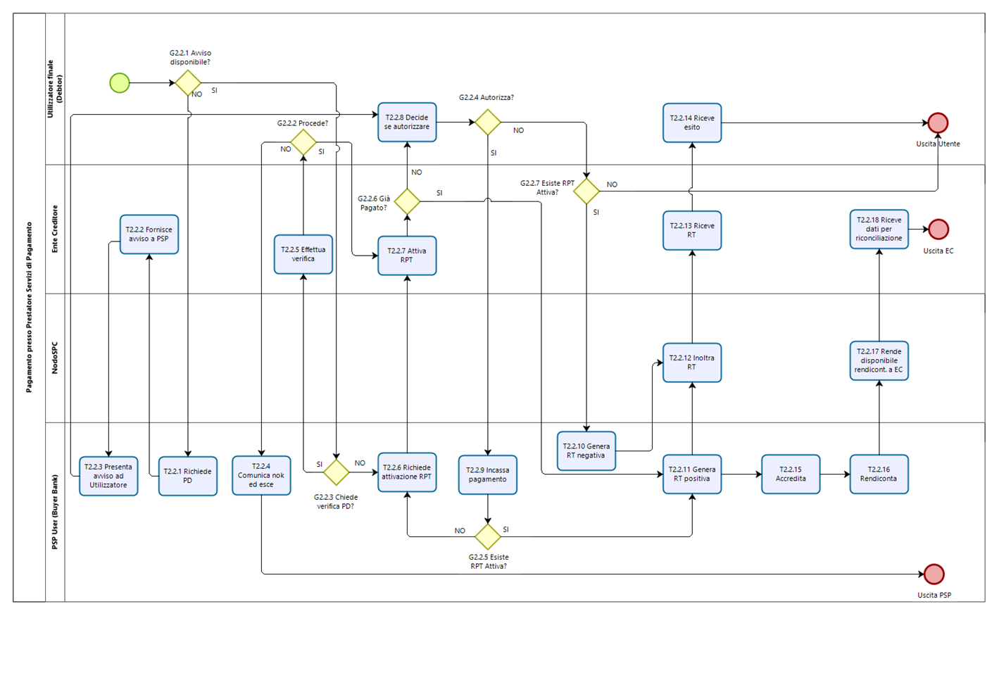

SEZIONE II -- REGOLE DI FUNZIONAMENTO DEL SISTEMA

I due diversi *workflow* gestiti sul Sistema pagoPA si differenziano
principalmente in base al soggetto che innesca il pagamento. Avremo
quindi un processo diverso se l'utilizzatore finale accede al servizio
di pagamento attraverso tecnologie e funzioni messe a disposizione da un
Ente Creditore ovvero attraverso tecnologie e funzioni messe a
disposizione da un Prestatore di Servizi di Pagamento

Nella presente sezione è modellato il processo di scambio dati tra i
sistemi informativi dei tre soggetti che partecipano a ogni processo di
pagamento mediati dal NodoSPC.

La modellazione risultante descrive quindi, da una parte, le specifiche
che definiscono il comportamento progettato del NodoSPC, riportando un
set di informazioni certe e conosciute (le primitive rese disponibili
dai Web Services, i dati di configurazione, etc.) e, in un'altra parte,
il comportamento atteso dei sistemi intermediati riportando l'insieme di
informazioni minime indispensabili alle funzioni informatiche
effettivamente sviluppate dai soggetti aderenti in qualità di Enti
Creditori o Prestatori di Servizi di Pagamento.

I dettagli delle primitive utilizzate in ciascun *workflow*, i
tracciati, gli errori e tutte le informazioni tecniche necessarie per
integrare servizi di Enti Creditori e Prestatori di Servizi di Pagamento
con il NodoSPC sono descritti nella sezione III.

La modellazione segue le notazioni dello standard *Business Process
Model and Notation* (BPMN) versione 2.0, di cui si riporta, in **Figura
1**, i simboli utilizzati e il loro significato.

{width="4.08163in"
height="3.56195in"}

**Figura** **1: Notazioni BPMN 2.0 utilizzate**

Gestione della posizione debitoria
==================================

Come previsto dalle Linee guida, tutte le tipologie di pagamento gestite
dal Sistema pagoPA prevedono che l'Ente Creditore, per rendere
realizzabile un pagamento, registri nei propri archivi le informazioni
necessarie per effettuare il pagamento e le metta a disposizione
dell'utilizzatore finale. Definiamo l'insieme di tali informazioni con
il termine di "posizione debitoria".

Nel Sistema pagoPA ogni pagamento presuppone la creazione propedeutica,
nel sistema informativo dell'Ente Creditore, di una posizione debitoria.
All'Ente Creditore compete la gestione degli stati del ciclo di vita
della posizione debitoria, che, in linea generale, corrispondono alle
attività di:

1.  Creazione. La posizione debitoria viene creata dall'Ente Creditore e
    posta nello stato di "Aperta". Si sottolinea che in questa sede si
    definisce "posizione debitoria" sia la creazione che avviene su
    iniziativa dell'Ente Creditore (es. maturazione delle condizioni per
    il pagamento di una imposta) sia quella che avviene su iniziativa
    dell'Utilizzatore finale (es. richiesta di un servizio), anche se in
    quest'ultimo caso l'Utilizzatore finale stesso non è effettivamente
    in debito con l'Ente Creditore.
2.  Aggiornamento. La posizione debitoria viene aggiornata dall'Ente
    Creditore ogni qualvolta intervengano eventi che ne modificano le
    informazioni associate (es sanzioni per decorrenza dei termini).
    L'attività di aggiornamento provoca un avanzamento di versione della
    posizione debitoria che permane nello stato di "Aperta".
3.  Blocco. La posizione debitoria viene bloccata e posta nello stato
    "In pagamento", a discrezione dell'Ente Creditore, nelle more del
    perfezionamento di un pagamento, onde evitare la possibilità di
    pagamenti ripetuti.
4.  Trasferimento. La posizione debitoria è posta nello stato di
    "Trasferita" nel caso in cui la competenza dell'incasso passi a un
    altro Ente Creditore (es. iscrizione in ruolo).
5.  Chiusura. L'Ente Creditore pone la posizione debitoria nello stato
    "Chiusa" ogni qualvolta viene effettuato un pagamento che salda il
    debito o intervengano eventi che la rendano non più pagabile. Tale
    stato è reversibile nel caso in cui intervenga una revoca del
    pagamento che pone di nuovo la posizione debitoria in una nuova
    versione dello stato di "Aperta".

Contestualmente alla creazione di una posizione debitoria, l'Ente
Creditore, se ne ricorrono le condizioni, deve predisporre un avviso di
pagamento che rappresenta lo strumento che rende possibile l'innesco del
pagamento stesso presso i PSP.

L'Ente Creditore genera il tradizionale avviso di pagamento
**analogico** (sotto forma di avviso cartaceo o file stampabile) ogni
qualvolta le norme lo obbligano a notificare a un debitore (cittadino o
impresa) l'insorgenza di una posizione debitoria aperta nei suoi
confronti. Tutte le norme di dettaglio che regolano la produzione di un
avviso di pagamento analogico sono incluse nel documento collegato *"Il
nuovo avviso di pagamento analogico nel sistema pagoPA"*.

L'EC continua a recapitare l'avviso analogico all'Utilizzatore finale
con le modalità tradizionali a cui può affiancare funzioni di stampa a
carico dell'Utilizzatore finale dopo il downloading del documento.

L'avviso di pagamento analogico, oltre al logotipo del Sistema pagoPA,
contiene le informazioni indispensabili per l\'esecuzione del pagamento,
che sono dettagliate nella sezione III.

Si attira l'attenzione sulla circostanza che l'importo dell'avviso di
pagamento contenuto nell'avviso analogico è quello corrispondente al
momento della produzione di tale documento e quindi può essere soggetto
a variazioni (in più o in meno) al momento in cui ne viene richiesto il
pagamento da parte dell'utilizzatore finale, nel caso sia intervenuto un
aggiornamento della posizione debitoria, purché tale possibilità sia
stata effettivamente esplicitata in una avvertenza sull'avviso.

La peculiarità di alcune postazioni messe a disposizione dai Prestatori
di Servizi di Pagamento rende necessario automatizzare l'acquisizione
dei dati presenti sull'avviso di pagamento. Per questo motivo tale
documento deve essere corredato, oltre che dati essenziali sopra citati,
anche da un insieme di elementi grafici facilmente leggibili e
decodificabili da apposite apparecchiature.

I processi di creazione, aggiornamento, chiusura o annullamento di una
posizione debitoria sono interni al sistema informativo dell'Ente
Creditore. Nei casi previsti tali operazioni scatenano l'invio di un
avviso di pagamento con strumenti digitali (avvisatura digitale), il cui
processo è tracciato nel seguito.

PagoPA consente all'Ente Creditore di affiancare all'avviso analogico un
avviso **digitale** di natura bonaria che, conservando lo stesso
contenuto informativo, permette la distribuzione e il pagamento in
modalità totalmente dematerializzata.

Con l'avvisatura digitale l'Ente Creditore permette agli utenti di
accedere allo stato corrente della propria posizione debitoria.
Attraverso il Sistema pagoPA è possibile gestire due tipologie di
avvisatura digitale:

-   Avvisatura digitale *push*, quando la distribuzione dell'avviso
    avviene per iniziativa dell'Ente Creditore
-   Avvisatura digitale *pull*, quando la distribuzione avviene per
    iniziativa di un Prestatore di Servizi di Pagamento per soddisfare
    una richiesta dell'Utilizzatore finale.

I paragrafi che seguono descrivono i *workflow* gestiti da pagoPA nei
due casi.

Avvisatura digitale *push* (su iniziativa dell'Ente Creditore)
--------------------------------------------------------------

La funzione di avvisatura digitale in modalità *push* è un servizio
messo a disposizione dal Sistema pagoPA attraverso il NodoSPC che
consente agli Utilizzatori finali di ricevere avvisi in formato
elettronico, in modo che il correlato pagamento possa essere effettuato
in modalità semplice e sicura utilizzando il Sistema pagoPA. Salvo
diverso avviso le notifiche digitali hanno un carattere bonario e quindi
si affiancano a quelle tradizionali, già previste dalla normativa, senza
sostituirle. Tuttavia, per consentire ai propri clienti la più ampia
possibilità di utilizzare tale strumento innovativo, l'Ente Creditore è
incentivato a utilizzarle anche nelle circostanze in cui la normativa
non pone un obbligo formale di notifica.

Per poter ricevere un avviso digitale l\'utilizzatore finale dovrà
dotarsi di un "cassetto digitale" che il NodoSPC utilizzerà per il
recapito, mediante la sottoscrizione di uno specifico contratto con un
soggetto abilitato da AgID a erogare tale servizio. I Prestatori di
Servizi di Pagamento hanno la possibilità di integrare con essa
ulteriori funzioni quali, a titolo di esempio, i servizi di pagamento
offerti sul Sistema pagoPA, notifiche sui dispositivi da essi gestiti,
(*app* su PC, *tablet* e *smartphone*, servizio di *home* *banking*,
ecc.), gestione delle scadenze, ecc.

Si puntualizza che l'Utilizzatore finale, ossia il soggetto destinatario
dell'avvisatura da parte dell'Ente Creditore, è sempre il soggetto
debitore identificato dall'Ente Creditore. PagoPA non preclude tuttavia
la possibilità che l'Utilizzatore finale chiamato a eseguire il relativo
pagamento possa essere un terzo (soggetto versante) in nome e per conto
del debitore (soggetto pagatore).

L\'adesione al servizio da parte dei Prestatori di Servizi di Pagamento
è facoltativa, mentre gli Enti Creditori che generano un avviso
analogico pagabile presso i Prestatori di Servizi di Pagamento dovranno
obbligatoriamente sviluppare tale funzionalità e distribuire una
versione digitale di ogni avviso analogico generato.

Il servizio in oggetto è monodirezionale in quanto prevede la
distribuzione di avvisi digitali da parte degli Enti Creditori verso gli
Utilizzatori finali, ma non prevede risposta da parte di questi ultimi.
L\'iscrizione al servizio di avvisatura effettuata dall\'utilizzatore
finale presso il Prestatore di Servizi di Pagamento avrà efficacia per
la ricezione di avvisi da parte di tutti gli Enti Creditori aderenti al
Sistema pagoPA.

L\'utente finale può iscriversi al servizio di avvisatura presso più
Prestatori di Servizi di Pagamento: in questo caso, in fase di
iscrizione presso un altro Prestatore di Servizi di Pagamento dovrà
ricevere una segnalazione di iscrizione \"multipla\" da parte del
Prestatore di servizi di pagamento che sta trattando l\'operazione.

La revoca dell'iscrizione al servizio di avvisatura deve essere
richiesta al Prestatore di Servizi di Pagamento, che ne stabilisce le
modalità.

Nel processo di avvisatura *push* (**Figura 2**) sono coinvolti quattro
soggetti:

-   utilizzatore finale
-   Ente Creditore
-   NodoSPC
-   Prestatore Servizi di Pagamento dell'Utilizzatore finale

{width="4.16697in"
height="3.89978in"}

**Figura** **2: Il processo di gestione dell'avvisatura push**

Il processo di avvisatura *push* è iniziato dall'Ente Creditore quando
genera una posizione debitoria (*Task* T1.1.1). Una volta generata la
posizione debitoria, l'Ente Creditore invia al NodoSPC gli avvisi
digitali da recapitare (*Task* T1.1.2).

Il NodoSPC (*Task* T1.1.3) esegue azioni differenti a seconda che
l'utilizzatore finale sia iscritto o meno al servizio presso un
Prestatore Servizi di Pagamento (*Gateway* G1.1.1):

-   Nel caso in cui l'utilizzatore finale sia iscritto tramite
    Prestatore Servizi di Pagamento, il NodoSPC invia l'avviso digitale
    al Prestatore Servizi di Pagamento (*Task* T1.1.3) che lo storicizza
    in un proprio database e ne dà notifica all'Utilizzatore finale
    (*Task* T1.1.4) in modo che sia a disposizione dello stesso (*Task*
    T1.1.5)
-   Negli altri casi, il NodoSPC non esegue alcuna azione.

Nel caso in cui l'Ente Creditore modifichi uno dei dati obbligatori
dell'avviso (ad esempio: l'importo), dovrà inviare al NodoSPC una nuova
copia dell'avviso digitale con l'indicazione che si tratta di un
aggiornamento.

Nel caso in cui l'Ente Creditore annulli un avviso digitale o tale
avviso risulti pagato con modalità diverse dal Sistema pagoPA, dovrà
inviare al NodoSPC una nuova copia dell'avviso digitale con
l'indicazione che si tratta di una cancellazione.

Il processo di aggiornamento e annullamento dell'avviso digitale è
analogo a quello della generazione (**Figura 3**).

Avvisatura digitale *pull* (verifica della posizione debitoria)
---------------------------------------------------------------

L'avvisatura *pull* è una funzionalità che l'Ente Creditore mette a
disposizione dell\'Utilizzatore finale per consentirgli di accedere alla
propria posizione debitoria.

Il Sistema pagoPA rende disponibili opportune funzioni di interscambio
affinché la posizione debitoria di un utilizzatore finale possa essere
interrogata attraverso altre funzioni messe a disposizione da Prestatore
di Servizi di Pagamento . Tale servizio viene erogato con
un'interrogazione della base dati dell'Ente Creditore di competenza,
integrato con il "cassetto digitale", e avviene secondo uno schema
sincrono, attivato dall\'Utilizzatore finale stesso attraverso le stesse
modalità descritte nel paragrafo precedente.

Nel processo in oggetto (**Figura 3**) sono coinvolti quattro soggetti:

-   Utilizzatore finale
-   Ente Creditore
-   NodoSPC
-   Prestatore Servizi di Pagamento dell'Utilizzatore finale

{width="4.37782in"
height="3.49935in"}

**Figura** **3: Il processo di gestione dell'avvisatura pull**

Il processo segue i seguenti passi:

-   L'utilizzatore finale accede ad una degli strumenti messi a
    disposizione dal Prestatore di Servizi di Pagamento richiedendo di
    conoscere la sua (*Task* T1.3.1) posizione debitoria
-   Il Prestatore di servizi di Pagamento inoltra la richiesta all'Ente
    Creditore attraverso il NodoSPC (*Task* T1.3.2 e T1.3.3)
-   L'Ente Creditore predispone la lista delle Posizione Debitorie
    relative all'utilizzatore finale (*Task* T1.3.4) e le inoltra al
    Prestatore di Servizi di Pagamento attraverso il NodoSPC (*Task*
    T1.3.5).
-   Il Prestatore di servizi di Pagamento riceve la posizione debitoria
    dell'Utilizzatore finale e può informarlo (*Task* T1.3.6)
-   L'utilizzatore finale a questo punto ha a disposizione la propria
    posizione debitoria (*Task* T1.3.7)

Al fine di prevenire utilizzi non consoni, il NodoSPC si riserva la
possibilità di applicare apposite regole di *throttling* (limitazioni
nell\'utilizzo). Le eventuali regole di *throttling* sono indicate nel
documento "*Indicatori di qualità per i Soggetti Aderenti*".
