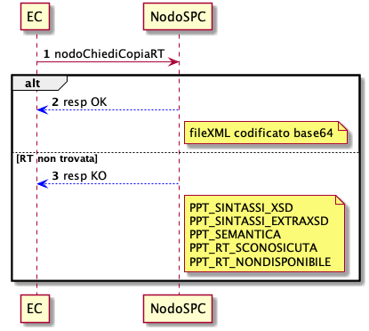
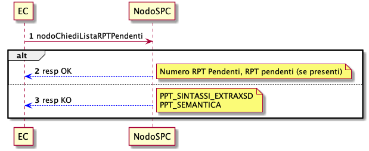
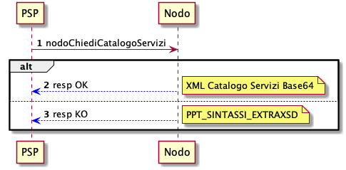
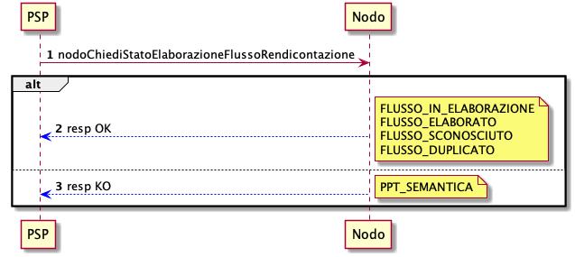
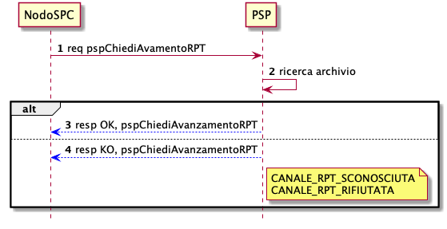

Funzioni e strategie di recupero
================================

Scenari, casi d’uso e attori
----------------------------

Le funzionalità ausiliarie disponibili all’interno del Sistema pagoPA
rappresentano funzionalità accessorie per la gestione dei processi
correlati alle operazioni di pagamento e possono essere utilizzate dagli
EC per il rientro da situazioni anomale o per le quali si renda
necessario il ripristino di situazioni precedenti.

Tali funzioni sono utilizzate anche dai PSP al fine di interrogare le
basi di dati messe a disposizione dal NodoSPC per l’esercizio del ciclo
di vita del pagamento. Si fa presente che le funzionalità ausiliarie
sono offerte dal NodoSPC attraverso interfacce SOAP consumabili dagli
attori coinvolti. A sua volta, anche il NodoSPC, in qualità di fruitore,
utilizza le funzionalità ausiliarie messe a disposizione dai PSP per la
verifica e gestione degli errori nei processi di pagamento.

**Figura** **1: Rappresentazione degli erogatori e fruitori delle
funzionalità di supporto**

Funzioni Ausiliarie per L’Ente Creditore
----------------------------------------

Il paragrafo si focalizza sulle funzioni ausiliarie del NodoSPC, ovvero
quelle funzioni, dedicate all’EC, che permettono l’espletamento dei
processi correlati alle operazioni di pagamento e/o consentono la
risoluzione di eventuali situazioni anomale o il rientro a stati
preesistenti.

### Richiesta della copia di una RT

L’EC ha facoltà di richiedere una copia della RT precedentemente
recapitata.

  -------- ---------------------------------------------------------------
  Pre-Cond L’EC riscontra delle condizioni anomale sui pagamenti
  izione   effettuati dagli utilizzatori finali o riscontra la perdita di
           una o più RT

  Trigger  Necessità di ripristino di una RT

  Descrizi L’EC sottomette la richiesta di ricevere una specifica RT
  one      precedentemente ricevuta

  Post-Con L’EC riceve la RT
  dizione  
  -------- ---------------------------------------------------------------

**Tabella** **1: Richiesta della copia di una RT**

> 

**Figura** **2: Richiesta della copia di una RT**

1.  L’EC sottomette al NodoSPC la richiesta di ricevere una copia della
    RT mediante la primitiva *nodoChiediCopiaRT*;

2.  La RT è correttamente trovata dal NodoSPC e restituita all’EC in
    allegato alla *response* positiva alla primitiva di cui al punto 1;

3.  Il NodoSPC replica negativamente alla richiesta precedente fornendo
    response KO alla primitiva di cui al punto 1 emanando un *faultBean*
    il cui *faultBean.faultCode* è rappresentativo dell’errore
    riscontrato; in particolare:
    -   PPT\_SINTASSI\_XSD: nel caso di errore di validazione della
        richiesta
    -   PPT\_SINTASSI\_EXTRAXSD: nel caso di errore di validazione della
        SOAP request
    -   PPT\_SEMANTICA: nel caso di errori semantici
    -   PPT\_RT\_SCONOSCIUTA: i parametri di input specificati nella
        richiesta non consentono di trovare alcuna RT
    -   PPT\_RT\_NONDOSPONIBILE: la RT richiesta non è disponibile.

### Richiesta della Lista delle RPT Pendenti

L’EC ha facoltà di domandare la lista delle RPT correttamente inviate al
PSP tramite il NodoSPC per le quali ancora non sono state ricevute le
RT.

  ------------- ----------------------------------------------------------
  Pre-Condizion L’EC ha sottomesso al NodoSPC un certo numero di RPT e non
  e             ha ricevuto le RT

  Trigger       Necessità di riconciliazione o chiusura delle posizioni
                pendenti

  Descrizione   L’EC sottomette la richiesta di ricevere la lista delle
                RPT pendenti

  Post-Condizio L’EC riceve la lista delle RPT
  ne            
  ------------- ----------------------------------------------------------

**Tabella** **2: Richiesta della Lista delle RPT Pendenti**

**Figura** **3: Richiesta della Lista delle RPT Pendenti**

1.  l’EC, mediante la primitiva *nodoChiediListaPendentiRPT* richiede al
    NodoSPC il numero e le RPT correttamente sottomesse ai PSP per le
    quali ancora non è stata ricevuta alcuna RT;

2.  il NodoSPC replica con esito OK indicando il numero totale e le RPT
    pendenti consegnate al PSP scelto dall’Utilizzatore finale per le
    quali ancora non è stata consegnata al NodoSPC alcuna RT;

3.  il NodoSPC replica con esito KO alla primitiva di cui al punto 1
    emanando un *faultBean* il cui *faultBean.faultCode* è
    rappresentativo dell’errore riscontrato; in particolare:
    -   PPT\_SINTASSI\_EXTRAXSD: nel caso di errori nella SOAP *request*
    -   PPT\_SEMANTICA: nel caso di errori semantici.

### Verifica dello stato di una RPT

  -------------- ---------------------------------------------------------
  Pre-Condizione L’EC ha sottomesso al NodoSPC una RPT

  Trigger        L’EC necessita di conoscere l’evoluzione temporale di una
                 specifica RPT

  Descrizione    L’EC sottomette la richiesta di conoscere lo stato di una
                 specifica RPT

  Post-Condizion L’EC riceve le informazioni inerenti lo stato della RPT
  e              
  -------------- ---------------------------------------------------------

**Tabella** **3: Verifica dello stato di una RPT**

**Figura** **4: Verifica dello stato di una RPT**

L’evoluzione temporale è la seguente:

1.  l’EC richiede di conoscere lo stato di una RPT mediante la primitiva
    *nodoChiediStatoRPT.*

**Caso OK**

2.  il NodoSPC replica positivamente alla primitiva di cui al punto 1
    fornendo nella *response* le informazioni peculiari per il
    tracciamento della RPT stessa; in particolare:
    -   *Redirect*: specifica se il pagamento prevede o meno una
        *redirect*
    -   *URL*: eventuale URL di *redirezione*
    -   *STATO*: stato della RPT
    -   *Descrizione*: descrizione dello stato della RPT
    -   *versamentiLista*: struttura contenente una lista di elementi
        che identificano gli stati assunti da ogni singolo versamento
        presente nella RPT da quando la RPT è stata ricevuta dal PSP.
        Ogni elemento della lista è costituito da:
        -   *progressivo*: numero del versamento nella RPT
        -   *data*: data relativa allo stato del versamento
        -   *stato*: stato della RPT alla data indicata
        -   *descrizione*: descrizione dello stato alla data

**Caso KO**

3.  il NodoSPC fornisce esito KO alla primitiva di cui al punto 1
    emanando un *fault.Bean* il cui *faultBean.faultCode* è
    rappresentativo dell’errore riscontrato; in particolare:
    -   PPT\_RPT\_SCONOSCIUTA: la RPT di cui si chiede lo stato non è
        stata trovata
    -   PPT\_SEMANTICA: nel caso di errori semantici
    -   PPT\_SINTASSI\_EXTRAXSD: Errore nella composizione della SOAP
        *request*

Funzioni ausiliarie per il PSP
------------------------------

### Richiesta del Catalogo dei Servizi

Il PSP interroga la base di dati del NodoSPC al fine di scaricare
l’ultima versione del Catalogo dei Servizi offerti dagli EC, da
utilizzare nell’ambito del Pagamento Spontaneo presso i PSP.

  ------------------------------------ ------------------------------------
  Pre-Condizione                       Il PSP decide di supportare i
                                       pagamenti spontanei pressi i propri
                                       sportelli

  Trigger                              Necessità di conoscere i servizi
                                       offerti dalle PA

  Descrizione                          Il PSP sottomette la richiesta di
                                       ricevere il file XML Catalogo dei
                                       Servizi attestante i servizi offerti
                                       dagli EC o da uno specifico Ente

  Post-Condizione                      Il PSP riceve il Catalogo dei
                                       Servizi degli EC
  ------------------------------------ ------------------------------------

**Tabella** **5: Richiesta del Catalogo dei Servizi**

**Figura** **6: Richiesta del Catalogo dei Servizi**

1.  il PSP richiede al NodoSPC di ricevere il Catalogo dei Servizi
    offerto dagli EC mediante la primitiva *nodoChiediCatalogoServizi;*

2.  il NodoSPC replica con *response* OK fornendo il tracciato XML del
    Catalogo dei Servizi codificato in Base64;

3.  Il NodoSPC replica con *response* KO emanando un *faultBean* il cui
    *faultBean*.*faultCode* è PPT\_SINTASSI\_EXTRAXSD.

### Richiesta informativa PA

  ---------- -------------------------------------------------------------
  Pre-Condiz L’EC ha sottomesso al Nodo la Tabella delle Controparti
  ione       

  Trigger    Il PSP necessita di conoscere la disponibilità dei servizi
             offerti dagli EC e i dati ad essi correlati

  Descrizion Il PSP sottomette al NodoSPC la richiesta della Tabella delle
  e          Controparti

  Post-Condi Il PSP riceve dal Nodo la Tabella delle Controparti
  zione      
  ---------- -------------------------------------------------------------

**Tabella** **7: Richiesta informativa PA**

**Figura** **8: Richiesta informativa PA**

1.  il PSP, mediante la primitiva *nodoChiediInformativaPA,* richiede al
    NodoSPC la Tabella delle Controparti degli EC.

2.  il NodoSPC replica con esito OK fornendo in output il documento XML
    codificato in Base64 rappresentante la Tabella delle Controparti
    degli EC;

3.  il NodoSPC replica con esito KO emanando un *faultBean* il cui
    *faultBean*.*faultCode* è PPT\_SINTASSI\_EXTRAXSD.

### Richiesta Stato Elaborazione Flusso di Rendicontazione

  -------- ---------------------------------------------------------------
  Pre-Cond Il PSP ha sottomesso un file XML di rendicontazione al NodoSPC
  izione   (mediante SOAP *request* o componente SFTP\_NodoSPC)

  Trigger  Il PSP necessita di conoscere lo stato di elaborazione del file
           XML di rendicontazione

  Descrizi Il PSP sottomette la richiesta passando come parametro di input
  one      *l’identificativoFlusso* del flusso di rendicontazione inviato

  Post-Con Il NodoSPC replica fornendo lo stato di elaborazione del flusso
  dizione  di rendicontazione
  -------- ---------------------------------------------------------------

**Tabella** **8: Richiesta Stato Elaborazione Flusso di
Rendicontazione**

**Figura** **9: Richiesta Stato Elaborazione Flusso di Rendicontazione**

1.  il PSP, attraverso la primitiva
    *nodoChiediStatoFlussoRendicontazione*, sottomette al NodoSPC la
    richiesta di conoscere lo stato di elaborazione di un flusso XML di
    rendicontazione precedentemente inviato valorizzando il parametro di
    input *identificaficativoFlusso*

**Caso OK**

2.  il NodoSPC replica positivamente alla primitiva precedente fornendo
    lo stato di elaborazione del flusso XML; in particolare:
    a.  FLUSSO\_IN\_ELABORAZIONE: il flusso XML è in fase di
        elaborazione/storicizzazione sulle basi di dati del NodoSPC
    b.  FLUSSO\_ELABORATO: Il flusso è stato correttamente elaborato e
        storicizzato dal NodoSPC
    c.  FLUSSO\_SCONOSCIUTO: il Nodo non conosce il flusso richiesto
    d.  FLUSSO\_DUPLICATO: il Nodo rileva che il flusso inviato è già
        stato sottomesso.

**Caso KO**

3.  Il NodoSPC il NodoSPC replica con esito KO emanando un *faultBean*
    il cui *faultBean*.*faultCode* è PPT\_SEMANTICA.

Funzioni Ausiliarie per il NodoSPC
----------------------------------

### Richiesta avanzamento RPT

  ----------- ------------------------------------------------------------
  Pre-Condizi Il NodoSPC ha sottomesso una RPT o un carrello di RPT al PSP
  one         

  Trigger     Il NodoSPC necessita di verificare lo stato di avanzamento
              di una RTP o di un

  Descrizione Il NodoSPC sottomette la richiesta di ricevere lo stato di
              una RPT o di un carrello di RPT

  Post-Condiz Il NodoSPC riceve lo stato della RPT o del carrello di RPT
  ione        
  ----------- ------------------------------------------------------------

**Tabella** **10: Richiesta avanzamento RPT**

**Figura** **11: Richiesta avanzamento RPT**

1.  il NodoSPC, mediante la primitiva *pspChiediAvanzamentoRPT,*
    richiede al PSP informazioni in merito allo stato di avanzamento di
    una RPT o di un carrello di RPT.

**Caso OK**

2.  il PSP replica con esito OK fornendo lo stato della RPT o del
    carrello di RPT;

**Caso KO**

3.  il PSP replica con esito KO emanando un *faultBean* il cui
    *faultBean*.*faultCode* è rappresentativo dell’errore riscontrato;
    in particolare:
    -   CANALE\_RPT\_SCONOSCIUTA: non è possibile trovare la RPT o il
        carrello di RPT per cui si richiede lo stato di elaborazione
    -   CANALE \_RPT\_RIFIUTATA: la RPT o il carrello di RPT sottomessi
        dal NodoSPC sono stati rifiutati dal PSP.

### Richiesta di avanzamento RT

  -------- ---------------------------------------------------------------
  Pre-Cond Il NodoSPC verifica lo stato avanzamento di una RT
  izione   

  Trigger  Il NodoSPC necessita di verificare lo stato di avanzamento
           della produzione della RT associata ad una RPT o a un carrello
           di RPT

  Descrizi Il NodoSPC sottomette la richiesta di ricevere lo stato di una
  one      RT

  Post-Con Il NodoSPC riceve lo stato della RT
  dizione  
  -------- ---------------------------------------------------------------

**Tabella** **11: Richiesta di avanzamento RT**

**Figura** **12: Richiesta di avanzamento RT**

1.  il NodoSPC, mediante la primitiva *pspChiediAvanzamentoRT,* richiede
    al PSP informazioni in merito allo stato di avanzamento della RT;
2.  Il PSP ricerca la RT nel proprio archivio;

3.  il PSP replica con esito OK fornendo lo stato della RT, specificando
    eventualmente il tempo richiesto per la sua generazione ed invio;

4.  il PSP replica con esito KO emanando un *faultBean* il cui
    *faultBean.faultCode* è rappresentativo dell’errore riscontrato; in
    particolare:
    -   CANALE\_RT\_SCONOSCIUTA: non è stata trovata la RT per la quale
        si richiede di conoscere lo stato di avanzamento
    -   CANALE\_RT\_RIFIUTATA\_EC: la RT è stata rifiutata dall’EC.

